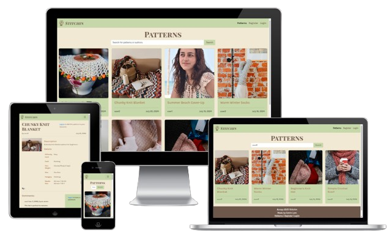
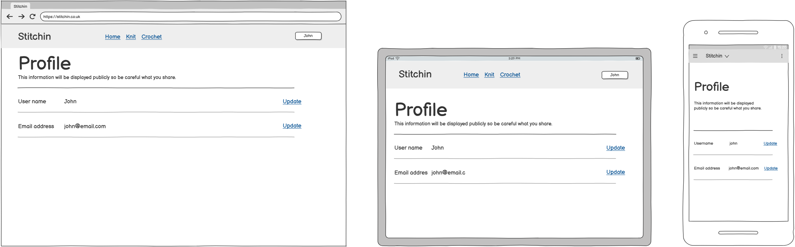

# Stitchin

## Introduction

Stitchin is a Django-based web application for users to share their knitting and crochet patterns. Other users can like and comment on these patterns, and add the pattern to their favourite so they can use the pattern later.



[UI Responsive Link](https://ui.dev/amiresponsive?url=https://stitchin-aa280977732a.herokuapp.com/)

> [!IMPORTANT]  
> I used [Allow X-Frame-Options](https://chromewebstore.google.com/detail/allow-x-frame-options/jfjdfokifdlmbkbncmcfbcobggohdnif) to access the UI Responsive page but please uninstall the extension after using it.

Visit the live site here: [Stitchin](https://stitchin.herokuapp.com/)

## Table of Contents

- [Stitchin](#stitchin)
  - [Introduction](#introduction)
  - [Table of Contents](#table-of-contents)
  - [Overview](#overview)
- [UX - User Experience](#ux---user-experience)
  - [Colour Scheme](#colour-scheme)
  - [Font](#font)
- [Project Planning](#project-planning)
  - [Agile Methodologies - Project Management](#agile-methodologies---project-management)
    - [MoSCoW Prioritization](#moscow-prioritization)
    - [Kanban Board](#kanban-board)
  - [User Stories](#user-stories)
    - [Visitor User Stories](#visitor-user-stories)
    - [User Profile](#user-profile)
    - [Pattern](#pattern)
    - [Favourite](#favourite)
    - [Comments](#comments)
  - [Skeleton](#skeleton)
    - [Wireframes](#wireframes)
    - [Database Schema - Entity Relationship Diagram](#database-schema---entity-relationship-diagram)
    - [Security](#security)
- [Features](#features)
  - [User View - Registered/Unregistered](#user-view---registeredunregistered)
  - [CRUD Functionality](#crud-functionality)
  - [Feature Showcase](#feature-showcase)
  - [Future Features](#future-features)
- [Technologies \& Languages Used](#technologies--languages-used)
  - [Libraries \& Frameworks](libraries--frameworks)
  - [Tools \& Programs](#tools--programs)
- [Testing](#testing)
- [Deployment](#deployment)
  - [PostgreSQL Database](#postgresql-database)
  - [Cloudinary API](#cloudinary-api)
  - [Heroku Deployment](#heroku-deployment)
  - [Local Deployment](#local-deployment)
  - [Clone Project](#clone-project)
  - [Fork Project](#fork-project)
- [AI Implementation and Orchestration](#ai-implementation-and-orchestration)
  - [Use Cases and Reflections](#use-cases-and-reflections)
  - [Code Creation](#code-creation)
  - [Debugging](#debugging)
  - [Performance and UX Optimization](#performance-and-ux-optimization)
  - [Development Workflow](#development-workflow)
  - [Overall Impact](#overall-impact)
- [Credits](#credits)
  - [Code](#code)
  - [Media](#media)
    - [Additional reading/tutorials/books/blogs](#additional-readingtutorialsbooksblogs)
  - [Acknowledgements](#acknowledgements)

## Overview

Stitchin is a platform designed for users to share their patterns with the community. The platform offers the following features:

- Registered users can:
  - Upload their patterns
  - Comment on other users' patterns
  - Add patterns to their own favourite
- Unregistered users can:
  - View the site
  - Browse through the available patterns

# UX - User Experience

## Colour Scheme

The color scheme for Stitchin is designed to be visually appealing andu user-friendly. The chosen colors are:

- **Primary Color:** #ADC178 (Olivine)
- **Secondary Color:** #A98467 (Chamoisee)
- **Dark Green Color**: #556B2F (Dark Olive Green)
- **Accent Color:** #C6D8A7 (Tea Green)
- **Background Color:** #F0EAD2 (Parchment)
- **Text Color:** #492E1C (Dark Brown)


## Font

The fonts used for Stitchin are chosen to enhance readability and aesthetics. The chosen fonts are:

- **Body Text:** [Karla](https://fonts.google.com/specimen/Karla)
- **Headings:** [Playfair Display SC](https://fonts.google.com/specimen/Playfair+Display+SC?preview.text=Stitchin)

# Project Planning

## Agile Methodologies - Project Management

I have used my GitHub project board to manage the project. I have created a project board with columns for each stage of the project. I have created issues for each task and assigned them to the relevant column. I have also used thes project board to track the progress of the project.

### MoSCoW Prioritization

- **Must Have:** User authentication, pattern sharing, commenting, liking.
- **Should Have:** User profiles, search functionality.
- **Could Have:** Pattern rating, tagging.
- **Won't Have:** Real-time chat.

### Kanban Board

The Kanban boarde used for this project is a GitHub project board with the following columns:

- **To Do:** Tasks that need to ber done.
- **In Progress:** Tasks that are currently being worked on.
- **Testing:** Tasks that are completed and need to be tested.
- **Done:** Tasks that are completed and tested.

You can view the project board [here](https://github.com/users/catrinlam/projects/6).

## User Stories

User stories are managed in the GitHub project board. I have created issues for each user story and assigned them to the relevant column.

Link to User Stories in GitHub Projects: [GitHub Projects Kanban Board](https://github.com/users/catrinlam/projects/6)

### Visitor User Stories

| User Story | Priority |
|----------------------------------------------------------------------------------------------------------------------------|---------------|
| As a **user**, I can **view the home page** so that I can **learn about the platform's features**. | MUST HAVE |
| As a **user**, I can **access the navigation bar** so that I can **navigate through the site**. | MUST HAVE |
| As a **user**, I can **see the footer** so that I can **access additional information and links**. | MUST HAVE |
| As a **user**, I can **browse through the patterns** so that I can **explore the available content**. | MUST HAVE |
| As a **user**, I can **register a new account** so that I can **upload and interact with patterns**. | MUST HAVE |

### User Profile

| User Story | Priority |
|----------------------------------------------------------------------------------------------------------------------------|---------------|
| As a **logged in user**, I can **delete my account** so that I can **remove my profile and all my personal data from the platform**. | MUST HAVE |
| As a **logged in user**, I can **log in via my email and password** so that I can **access my account**. | MUST HAVE |
| As a **logged in user**, I can **log out of my account** so that I can **securely end my session**. | MUST HAVE |
| As a **logged in user**, I can **see notifications when I register, update, or delete my account** so that I am **informed of the changes**. | SHOULD HAVE |
| As a **logged in user**, I can **see my username at the top right corner** so that I know I am **logged in**. | MUST HAVE |

### Pattern

| User Story | Priority |
|----------------------------------------------------------------------------------------------------------------------------|---------------|
| As a **logged in user**, I can **upload new patterns to the platform** so that I can **share my creations with the community**. | MUST HAVE |
| As a **logged in user**, I can **delete my own pattern** so that I can **remove it if needed**. | MUST HAVE |
| As a **logged in user**, I can **add other users as collaborators to the pattern** so that we can **work on it together**. | COULD HAVE |
| As a **logged in user**, I can **see notifications when I upload a pattern** so that I am **informed of the changes**. | SHOULD HAVE |
| As a **user**, I can **search for a pattern** so that I can **find specific patterns quickly**. | SHOULD HAVE |
| As a **logged in user**, I can **like/unlike a pattern** so that I can **show my appreciation for it**. | COULD HAVE |

### Favourite

| User Story | Priority |
|----------------------------------------------------------------------------------------------------------------------------|---------------|
| As a **logged in user**, I can **add the pattern to my favourite** so that I can **easily access it later**. | MUST HAVE |
| As a **logged in user**, I can **remove a pattern from my favourite** so that I can **manage my saved patterns**. | MUST HAVE |
| As a **logged in user**, I can **create collections in my favourite** so that I can **organize my patterns**. | COULD HAVE |
| As a **logged in user**, I can **see notifications when I add or remove a pattern from my favourite** so that I am **informed of the changes**. | SHOULD HAVE |

### Comments

| User Story | Priority |
|----------------------------------------------------------------------------------------------------------------------------|---------------|
| As a **logged in user**, I can **comment on a pattern** so that I can **share my thoughts and feedback**. | MUST HAVE |
| As a **logged in user**, others can **comment on my comment** so that we can **have a discussion**. | COULD HAVE |
| As a **logged in user**, I can **update my comment** so that I can **correct or improve it**. | MUST HAVE |
| As a **logged in user**, I can **delete my comment** so that I can **remove it if needed**. | MUST HAVE |
| As a **logged in user**, I can **see notifications when I comment on a pattern** so that I am **informed of the activity**. | SHOULD HAVE |

# Skeleton

## Wireframes

The wireframes for Stitchin were created using Balsamiq. They include views for desktop, tablet, and mobile devices to ensure a responsive design.

- **Home Page**
  - The home page provides an overview of the platform and its features.
  

- **Pattern Page**
  - The pattern page displays individual patterns with details and user interactions.
  

- **Sign Up Page**
  - The sign-up page allows new users to create an account on the platform.
  

- **Profile Page**
  - The profile page allows users to view and edit their personal information.
  

- **Upload Pattern Page**
  - The upload pattern page enables users to upload new patterns to the platform.
  

- **Favourite Page**
  - The favourite page shows the patterns saved by the user in their personal favourite.
  


## Database Schema - Entity Relationship Diagram

The database schema for Stitchin was created using dbdiagram.io. It includes tables for users, patterns, comments, favourites, and pattern hooks needles.


## Security

Stitchin employs several security measures to protect user data and ensure a safe user experience:

- **User Authentication:** User registration and authentication are handled by [Django AllAuth](https://django-allauth.readthedocs.io/en/latest/).
- **Defensive Design:** Input validation and error messages provide feedback to users, guiding them towards the desired outcome. Unregistered users are redirected to the login page when trying to access restricted features.
- **CSRF Protection:** CSRF (Cross-Site Request Forgery) tokens are included in every form to help authenticate the request with the server when the form is submitted.

# Features

## User View - Registered/Unregistered

| Page                  | Unregistered Users | Logged-in Users |
|-----------------------|--------------------|-----------------|
| Home Page             | Visible            | Visible         |
| Pattern Page          | Visible            | Visible         |
| Profile Page          | Not Visible, showing the 'sign up/log in' button only | Visible         |
| Upload Pattern Page   | Not Visible        | Visible         |
| Favourite Page          | Not Visible        | Visible         |

## CRUD Functionality

| Feature  | Create | Read | Update | Delete |
|----------|--------|------|--------|--------|
| Pattern  | Yes    | Yes  | No    | No    |
| Profile  | Yes    | No  | No    | No    |
| Favourite  | Yes (Created upon registration) | Yes  | Yes    | No (It is unnecessary to delete the user's favourite as it is intended for them to save the interested patterns for later) |
| Comments | Yes    | Yes  | Yes    | Yes    |

## Feature Showcase

<details>
    <summary>Header: Provides navigation links to different sections of the site.</summary>  
      
</details>

<details>
    <summary>Footer: Provides additional information and links.</summary>  
      
</details>
<details>
    <summary>Home Page: Provides an overview of the platform and its features.</summary>  
      
</details>

<details>
    <summary>Pattern Page: Displays individual patterns with details and user interactions.</summary>  
      
</details>
<details>
    <summary>Upload Pattern Page: Enables users to upload new patterns to the platform.</summary>  
      
</details>

<details>
    <summary>Favourite Page: Shows the patterns saved by the user in their personal favourite.</summary>  
      
</details>

## Future Features

- **Comment on Comments:** Allow users to comment on others' comments and like comments.
- **Tagging:** Allow users to tag patterns for better categorization.
- **Create Collection within Favourite:** Allow users to create collections within their favourite to categorize the patterns.
- **More Knitting Tools and Pattern Details:** Allow users to upload different crafts with more pattern details.
- **Buying Pattern:** Enable users to sell their patterns and other users to support the creators.

# Technologies & Languages Used

## Libraries & Frameworks

- **HTML**
- **CSS**
- **JavaScript**
- **Python**
- **Django**

## Tools & Programs

- **Cloudinary:** Used for cloud media storage for images.
- **Git:** Used for version control.
- **GitHub:** Used for online storage of codebase and Projects tool.
- **Heroku:** Used to host the website.
- **Balsamiq:** Used for creating wireframes.
- **Coolors:** Used for creating the color theme.
- **Favicon:** Used for converting the icon into favicon.

# Testing

Please refer to [TESTING.md](TESTING.md) for all testing.

# Deployment

The live deployed application can be found deployed on [here](https://stitchin-aa280977732a.herokuapp.com/).

## PostgreSQL Database

This project uses a [Code Institute PostgreSQL Database](https://dbs.ci-dbs.net).

## Cloudinary API

This project uses the [Cloudinary API](https://cloudinary.com) for storing media assets online, as Heroku does not support persistent storage for this type of data.

To obtain your own Cloudinary API key, create an account and log in.

- On your Cloudinary Dashboard, you can copy your **API Environment Variable**.
- Be sure to remove the `CLOUDINARY_URL=` as part of the API **value**; this is the **key**.

## Heroku Deployment

This project uses [Heroku](https://www.heroku.com), a platform as a service (PaaS) that enables developers to build, run, and operate applications entirely in the cloud.

Deployment steps are as follows, after account setup:

- Select **New** in the top-right corner of your Heroku Dashboard, and select **Create new app** from the dropdown menu.
- Your app name must be unique, and then choose a region closest to you, and finally, select **Create App**.
- From the new app **Settings**, click **Reveal Config Vars**, and set your environment variables.

> [!IMPORTANT]  
> This is a sample only; you would replace the values with your own if cloning/forking my repository.

| Key | Value |
| --- | --- |
| `DATABASE_URL` | user's own value |
| `SECRET_KEY` | user's own value |
| `CLOUDINARY_URL` | user's own value |
| `DISABLE_COLLECTSTATIC` | 1 (*this is temporary, and can be removed for the final deployment*) |

Heroku needs three additional files in order to deploy properly.

- requirements.txt
- Procfile
- runtime.txt

You can install this project's **requirements** (where applicable) using:

- `pip3 install -r requirements.txt`

If you have your own packages that have been installed, then the requirements file needs updated using:

- `pip3 freeze --local > requirements.txt`

The **Procfile** can be created with the following command:

- `echo web: gunicorn <app_name>.wsgi > Procfile`
- *replace **<app_name>** with the name of your primary Django app name; the folder where settings.py is located*

The **runtime.txt** file needs to know which Python version you're using:
1. type: `python3 --version` in the terminal.
2. in the **runtime.txt** file, add your Python version:
    - `python-3.12.3`

For Heroku deployment, follow these steps to connect your own GitHub repository to the newly created app:

Either:

- Select **Automatic Deployment** from the Heroku app.

Or:

- In the Terminal/CLI, connect to Heroku using this command: `heroku login -i`
- Set the remote for Heroku: `heroku git:remote -a app_name` (replace *app_name* with your app name)
- After performing the standard Git `add`, `commit`, and `push` to GitHub, you can now type:
    - `git push heroku main`

In Heroku, you need to select your own GitHub repository and click the `Deploy` button.

The project should now be connected and deployed to Heroku!

## Local Deployment

This project can be cloned or forked in order to make a local copy on your own system.

For either method, you will need to install any applicable packages found within the *requirements.txt* file.

- `pip3 install -r requirements.txt`.

You will need to create a new file called `env.py` at the root-level, and include the same environment variables listed above from the Heroku deployment steps.

> [!IMPORTANT]  
> This is a sample only; you would replace the values with your own if cloning/forking my repository.

Sample `env.py` file:

```python
import os

os.environ.setdefault("DATABASE_URL", "<user's own value>")
os.environ.setdefault("CLOUDINARY_URL", "<user's own value>")
os.environ.setdefault("SECRET_KEY", "<user's own value>")

# local environment only (do not include these in production/deployment!)
os.environ.setdefault("DEBUG", "True")
```

## Clone Project

You can clone the repository by following these steps:

1. Go to the [GitHub repository](https://github.com/shar-nm/lens-whisperer)
2. Locate the Code button above the list of files and click it
3. Select if you prefer to clone using HTTPS, SSH, or GitHub CLI and click the copy button to copy the URL to your clipboard
4. Open Git Bash or Terminal
5. Change the current working directory to the one where you want the cloned directory
6. In your IDE Terminal, type the following command to clone my repository:
   - `git clone https://github.com/catrinlam/stitchin.git`
7. Press Enter to create your local clone.

## Fork Project

By forking the GitHub Repository, we make a copy of the original repository on our GitHub account to view and/or make changes without affecting the original owner's repository.
You can fork this repository by using the following steps:

1. Log in to GitHub and locate the [GitHub Repository](https://github.com/catrinlam/stitchin)
2. At the top of the Repository (not top of page) just above the "Settings" Button on the menu, locate the "Fork" Button.
3. Once clicked, you should now have a copy of the original repository in your own GitHub account

# AI Implementation and Orchestration

## Use Cases and Reflections
Throughout the development of Stitchin, GitHub Copilot was integrated into the workflow to assist with various aspects of coding, debugging, and optimisation. This project marked a significant step in leveraging AI-powered development tools to enhance efficiency and maintain code quality.

## Code Creation

**Reflection:** Initially, GitHub Copilot was primarily used to generate repetitive boilerplate code, such as Django models, serializers, and views. Over time, its utility expanded beyond that, as it provided alternative implementations and prompted exploration of more efficient coding patterns. One key benefit was its ability to suggest more concise and Pythonic ways to handle database queries, which streamlined the development process.

**Highlight:** The iterative nature of working with Copilot improved the clarity of prompts and requests. By refining input queries, the quality of generated code improved, demonstrating the importance of structured communication with AI tools.

## Debugging

**Reflection:** Copilot played a role in identifying potential errors and inconsistencies within the codebase. While it was not a replacement for manual debugging, it provided suggestions that highlighted overlooked issues. Additionally, it facilitated simplifications in complex logic, making the codebase more maintainable and readable.

## Performance and UX Optimization

**Reflection:** Copilot contributed to refining the front-end experience, particularly in styling and responsiveness. While front-end development was not a primary focus, AI-assisted recommendations improved UI consistency by suggesting minor but effective changes, such as adjusting breakpoints and optimising Bootstrap styling. These refinements enhanced the overall user experience.

## Development Workflow

**Reflection:**  The integration of Copilot influenced the approach to development, encouraging an iterative workflow. It provided a secondary perspective when structuring new features and prompted considerations that might not have been initially accounted for. However, while its suggestions were valuable, they occasionally required significant modification to align with project-specific requirements.

## Overall Impact

Using AI-assisted development tools like GitHub Copilot proved beneficial in streamlining repetitive tasks, debugging, and optimising code structure. However, it was evident that AI should complement, rather than replace, core development skills. The experience reinforced the importance of critical evaluation when incorporating AI-generated solutions, ensuring that code remains maintainable, efficient, and aligned with best practices.

The process of working with AI tools also encouraged a more structured approach to problem-solving and documentation. Clearer articulation of requirements led to improved results, both in AI-assisted development and broader software engineering practices.

# Credits

## Code

- Readme structure from [project readme guide](https://github.com/Code-Institute-Org/html-css-project/blob/main/sample-full-stack-capstone-readme.md#ai-implementation-and-orchestration), [example project 1](https://github.com/amylour/FreeFido_v2/blob/main/README.md) and [example project 2](https://github.com/shar-nm/lens-whisperer/blob/main/README.md)

- Django Tutorial - [I Think Therefore I Blog](https://learn.codeinstitute.net/courses/course-v1:CodeInstitute+FSD101_WTS+4/courseware)

## Media

- [Flaticon](https://www.flaticon.com/) - favicon design

| Source | Author | Link |
|--------|--------|------|
| Pexels | Anna Tukhfatullina | [Link](https://www.pexels.com/photo/two-knitted-bags-2557040/) |
| Pexels | Daniel Duarte | [Link](https://www.pexels.com/photo/crotcheted-teddy-bear-18371014/) |
| Pexels | Magda Ehlers | [Link](https://www.pexels.com/photo/a-white-crochet-coaster-on-top-of-a-cup-6492211/) |
| Pexels | Arina Krasnikova | [Link](https://www.pexels.com/photo/scissors-on-book-on-handmade-blanket-5709754/) |
| Pexels | Fernanda Gomez de la torre | [Link](https://www.pexels.com/photo/brunette-woman-on-vacation-11501728/) |
| Pexels | Ryutaro Tsukata | [Link](https://www.pexels.com/photo/booties-and-green-christmas-wreath-6249721/) |
| Pexels | Kaboompics.com | [Link](https://www.pexels.com/photo/a-person-wearing-gray-socks-6632990/) |
| Pexels | freestocks.org | [Link](https://www.pexels.com/photo/close-up-photo-of-knitted-footwear-of-newborn-babies-7341306/) |
| Unsplash | Milada Vigerova | [Link](https://unsplash.com/photos/white-v-neck-shirt-on-brown-clothes-hanger-p8Drpg_duLw) |
| Unsplash | Lucky Alamanda | [Link](https://unsplash.com/photos/three-knitted-hats-with-a-blue-ribbon-around-them-6f7veovi2U4) |
| Unsplash | Thea Hdc | [Link](https://unsplash.com/photos/blue-and-white-floral-textile-7Y4o5dmxzIQ) |
| Unsplash | kids&me Germany | [Link](https://unsplash.com/photos/brown-bear-plush-toy-Zzgmde4_lYU) |
| Unsplash | Karen Cantú Q | [Link](https://unsplash.com/photos/person-holding-red-and-white-disposable-cup-uYF7pziBO8Y) |

## Acknowledgements

I would like to express my heartfelt gratitude to my family and partner for believing in me and supporting me throughout the Bootcamp.

A huge thank you to my Learning Facilitator, [Emma Lamont](https://github.com/elamont174 ), for her invaluable guidance, patience, and for always being there to answer my questions.

I am also incredibly grateful to my mentor, [Spencer Barriball](https://github.com/5pence), for his support and insightful advice.

Lastly, thank you to my Coding Coachs, [Ruairidh MacArthur](https://github.com/roomacarthur), and [John Rearden](https://github.com/johnrearden) for their support and encouragement whenever I encountered coding challenges.