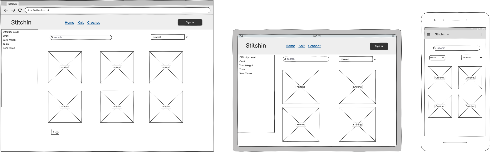
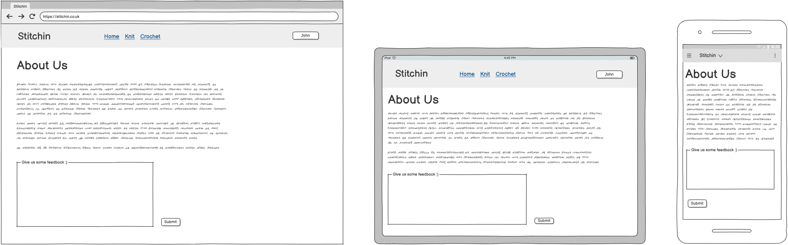

# Stitchin

## Introduction

Stitchin is a Django-based web application for users to share their knitting and crochet patterns. Other users can like and comment on these patterns, and add the pattern to their library so they can use the pattern later.

Visit the live site here: [Stitchin](https://stitchin.herokuapp.com/)

## Table of Contents

- [Stitchin](#stitchin)
  - [Introduction](#introduction)
  - [Table of Contents](#table-of-contents)
  - [Overview](#overview)
- [UX - User Experience](#ux---user-experience)
  - [Colour Scheme](#colour-scheme)
  - [Font](#font)
- [Project Planning](#project-planning)
  - [Agile Methodologies - Project Management](#agile-methodologies---project-management)
    - [MoSCoW Prioritization](#moscow-prioritization)
    - [Kanban Board](#kanban-board)
  - [User Stories](#user-stories)
    - [Visitor User Stories](#visitor-user-stories)
    - [User Profile](#user-profile)
    - [Pattern](#pattern)
    - [Library](#library)
    - [Comments](#comments)
    - [Visit Us/Reviews](#visit-usreviews)
  - [Skeleton](#skeleton)
    - [Wireframes](#wireframes)
    - [Database Schema - Entity Relationship Diagram](#database-schema---entity-relationship-diagram)
    - [Security](#security)
- [Features](#features)
  - [User View - Registered/Unregistered](#user-view---registeredunregistered)
  - [CRUD Functionality](#crud-functionality)
  - [Feature Showcase](#feature-showcase)
  - [Future Features](#future-features)
- [Technologies \& Languages Used](#technologies--languages-used)
  - [Libraries \& Frameworks](#libraries--frameworks)
  - [Tools \& Programs](#tools--programs)
- [Testing](#testing)
- [Deployment](#deployment)
  - [Connecting to GitHub](#connecting-to-github)
  - [Django Project Setup](#django-project-setup)
  - [Cloudinary API](#cloudinary-api)
  - [Elephant SQL](#elephant-sql)
  - [Heroku deployment](#heroku-deployment)
  - [Clone project](#clone-project)
  - [Fork Project](#fork-project)
- [Credits](#credits)
  - [Code](#code)
  - [Media](#media)
    - [Additional reading/tutorials/books/blogs](#additional-readingtutorialsbooksblogs)
  - [Acknowledgements](#acknowledgements)

## Overview

Stitchin is a platform designed for users to share their patterns with the community. The platform offers the following features:

- Registered users can:
  - Upload their patterns
  - Comment on other users' patterns
  - Add patterns to their own library
- Unregistered users can:
  - View the site
  - Browse through the available patterns

# UX - User Experience

## Colour Scheme

The color scheme for Stitchin is designed to be visually appealing andu user-friendly. The chosen colors are:

- **Primary Color:** #ADC178 (Olivine)
- **Secondary Color:** #A98467 (Chamoisee)
- **Accent Color:** #6C584C (Umber)
- **Background Color:** #F6F1E1 (Ivory)
- **Text Color:** #343A40 (Dark Gray)

## Font

The fonts used for Stitchin are chosen to enhance readability and aesthetics. The chosen fonts are:

- **Body Text:** [Karla](https://fonts.google.com/specimen/Karla)
- **Headings:** [Playfair Display SC](https://fonts.google.com/specimen/Playfair+Display+SC?preview.text=Stitchin)

# Project Planning

## Agile Methodologies - Project Management

I have used my GitHub project board to manage the project. I have created a project board with columns for each stage of the project. I have created issues for each task and assigned them to the relevant column. I have also used thes project board to track the progress of the project.

### MoSCoW Prioritization

- **Must Have:** User authentication, pattern sharing, commenting, liking.
- **Should Have:** User profiles, search functionality.
- **Could Have:** Pattern rating, tagging.
- **Won't Have:** Real-time chat.

### Kanban Board

The Kanban boarde used for this project is a GitHub project board with the following columns:

- **To Do:** Tasks that need to ber done.
- **In Progress:** Tasks that are currently being worked on.
- **Testing:** Tasks that are completed and need to be tested.
- **Done:** Tasks  that are completed and tested.

You can view the project board [here](https://github.com/users/catrinlam/projects/6).

## User Stories

User stories are managed in the GitHub project board. I have created issues for each user story and assigned them to the relevant column.

### Visitor User Stories

| User Story | Priority |
|----------------------------------------------------------------------------------------------------------------------------|---------------|
| As a **user**, I can **view the home page** so that I can **learn about the platform's features**. | MUST HAVE |
| As a **user**, I can **access the navigation bar** so that I can **navigate through the site**. | MUST HAVE |
| As a **user**, I can **see the footer** so that I can **access additional information and links**. | MUST HAVE |
| As a **user**, I can **browse through the patterns** so that I can **explore the available content**. | MUST HAVE |
| As a **user**, I can **register a new account** so that I can **upload and interact with patterns**. | MUST HAVE |

### User Profile

| User Story | Priority |
|----------------------------------------------------------------------------------------------------------------------------|---------------|
| As a **registered user**, I can **create and update my profile** so that I can **personalize my account**. | MUST HAVE |
| As a **registered user**, I can **delete my account** so that I can **remove my profile and all my personal data from the platform**. | MUST HAVE |
| As a **registered user**, I can **log in via my email and password** so that I can **access my account**. | MUST HAVE |
| As a **registered user**, I can **log out of my account** so that I can **securely end my session**. | MUST HAVE |
| As a **registered user**, I can **see notifications when I register, update, or delete my account** so that I am **informed of the changes**. | SHOULD HAVE |

### Pattern

| User Story | Priority |
|----------------------------------------------------------------------------------------------------------------------------|---------------|
| As a **registered user**, I can **upload new patterns to the platform** so that I can **share my creations with the community**. | MUST HAVE |
| As a **registered user**, I can **edit my own pattern** so that I can **update or correct it**. | MUST HAVE |
| As a **registered user**, I can **delete my own pattern** so that I can **remove it if needed**. | MUST HAVE |
| As a **registered user**, I can **add other users as collaborators to the pattern** so that we can **work on it together**. | COULD HAVE |
| As a **registered user**, I can **see notifications when I upload, update, or delete a pattern** so that I am **informed of the changes**. | SHOULD HAVE |
| As a **user**, I can **search for a pattern** so that I can **find specific patterns quickly**. | SHOULD HAVE |
| As a **user**, I can **filter out in the search bar** so that I can **narrow down the patterns based on criteria**. | SHOULD HAVE |
| As a **registered user**, I can **like/unlike a pattern** so that I can **show my appreciation for it**. | COULD HAVE |

### Library

| User Story | Priority |
|----------------------------------------------------------------------------------------------------------------------------|---------------|
| As a **registered user**, I can **add the pattern to my library** so that I can **easily access it later**. | MUST HAVE |
| As a **registered user**, I can **remove a pattern from my library** so that I can **manage my saved patterns**. | MUST HAVE |
| As a **registered user**, I can **create collections in my library** so that I can **organize my patterns**. | COULD HAVE |
| As a **registered user**, I can **see notifications when I add or remove a pattern from my library** so that I am **informed of the changes**. | SHOULD HAVE |

### Comments

| User Story | Priority |
|----------------------------------------------------------------------------------------------------------------------------|---------------|
| As a **registered user**, I can **comment on a pattern** so that I can **share my thoughts and feedback**. | MUST HAVE |
| As a **registered user**, others can **comment on my comment** so that we can **have a discussion**. | COULD HAVE |
| As a **registered user**, I can **see notifications when I comment on a pattern** so that I am **informed of the activity**. | SHOULD HAVE |

### About Us/Reviews

| User Story | Priority |
|----------------------------------------------------------------------------------------------------------------------------|---------------|
| As a **user**, I can **leave a review** so that I can **share my experience with others**. | SHOULD HAVE |

# Skeleton

## Wireframes

The wireframes for Stitchin were created using Balsamiq. They include views for desktop, tablet, and mobile devices to ensure a responsive design.

- **Home Page**
  - The home page provides an overview of the platform and its features.
  

- **Pattern Page**
  - The pattern page displays individual patterns with details and user interactions.
  

- **Profile Page**
  - The profile page allows users to view and edit their personal information.
  

- **Upload Pattern Page**
  - The upload pattern page enables users to upload new patterns to the platform.
  

- **Library Page**
  - The library page shows the patterns saved by the user in their personal library.
  

- **Sign Up Page**
  - The sign-up page allows new users to create an account on the platform.
  

- **About Us/Reviews Page**
  - The About Us/Reviews page provides information about the platform and allows users to leave reviews.
  

## Database Schema - Entity Relationship Diagram

The database schema for Stitchin was created using dbdiagram.io. It includes tables for users, patterns, comments, libraries, and pattern hooks needles.

## Security

Stitchin employs several security measures to protect user data and ensure a safe user experience:

- **User Authentication:** User registration and authentication are handled by [Django AllAuth](https://django-allauth.readthedocs.io/en/latest/).
- **Defensive Design:** Input validation and error messages provide feedback to users, guiding them towards the desired outcome. Unregistered users are redirected to the login page when trying to access restricted features.
- **CSRF Protection:** CSRF (Cross-Site Request Forgery) tokens are included in every form to help authenticate the request with the server when the form is submitted.

# Features

## User View - Registered/Unregistered

## CRUD Functionality

## Feature Showcase

# Technologies & Languages Used

## Libraries & Frameworks

## Tools & Programs

# Testing

# Deployment

## Connecting to GitHub

## Django Project Setup

## Cloudinary API

## Elephant SQL

## Heroku deployment

## Clone project

## Fork Project

# Credits

## Code

- Readme structure from [example project](https://github.com/amylour/FreeFido_v2/blob/main/README.md)

## Media

### Additional reading/tutorials/books/blogs

## Acknowledgements
