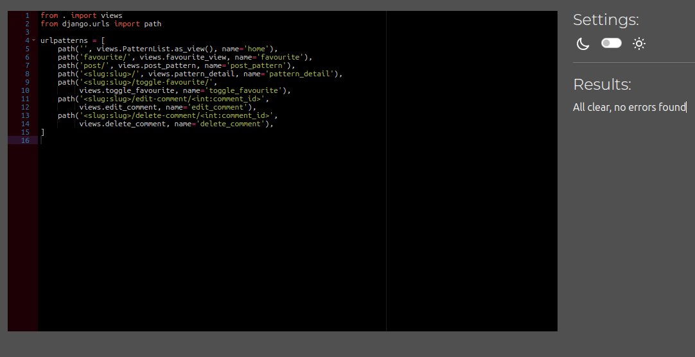

# Testing

This is the TESTING file for the [Stitchin]() website.

Return back to the [README.md](README.md) file.

## Testing Contents  
  
- [Testing](#testing)
  - [Testing Contents](#testing-contents)
  - [Validation](#validation)
    - [HTML Validation](#html-validation)
    - [JavaScript Validation](#javascript-validation)
    - [Python Validation](#python-validation)
    - [CSS Validation](#css-validation)
    - [Lighthouse Scores](#lighthouse-scores)
    - [Wave Accessibility Evaluation](#wave-accessibility-evaluation)
  - [Unit Testing](#unit-testing)
  - [Manual Testing](#manual-testing)
    - [User Input/Form Validation](#user-inputform-validation)
    - [Testing User Stories](#testing-user-stories)
  - [Bugs](#bugs)

## Validation

### HTML Validation

[HTML validation](https://validator.w3.org/nu/?doc=https%3A%2F%2Fstitchin-aa280977732a.herokuapp.com%2F)

| HTML Source Code/Page | Errors | Warnings | Note                             |
| --------------------- | ------ | -------- | -------------------------------- |
| Home                  | 0      | 0        |                                  |
| Sign In               | 0      | 0        |                                  |
| [Sign Up](docs/testing/html_signup.png)               | 1      | 0        | Error based on built-in Django form       |
| Pattern Detail        | 0      | 0        |                                  |
| Post Pattern          | 0      | 0        |                                  |
| Delete Comment        | 0      | 0        | |
| View Favourites       | 0      | 0        |                                  |
| Log Out               | 0      | 0        |                                  |
| Forgot Password       | 0      | 0        | 

### JavaScript Validation

[JSHint](https://jshint.com/) was used to validate the small amount of JavaScript code added to the project.

| File          | Screenshot | Notes |
|---------------|------------|-------|
| pattern_form.js |  | No errors found |
| comments.js   |  | Warning due to `bootstrap` being defined in the `base.html` file |

**Note:** The `/*jshint esversion: 6 */` directive was added to the top of the JavaScript files to specify the ECMAScript version.

### Python Validation

[CI Python Linter](https://pep8ci.herokuapp.com/#) was used to validate the Python files.

| File       | Screenshot | Notes |
|------------|------------|-------|
| admin.py   |  | No errors found |
| forms.py   |  | No errors found |
| models.py  |  | No errors found |
| urls.py    |  | No errors found |
| views.py   |  | No errors found |

### CSS Validation 

[W3C CSS Validator](https://jigsaw.w3.org/css-validator/) was used to validate my CSS file.

  

 
   
### Lighthouse Scores

Lighthouse testing was carried out in Incognito mode to achieve the best result.

**Desktop**  

  
*Desktop Home Page*  
  
  
*Desktop Pattern Page*

**Mobile**  

 
*Mobile Home Page*  
  
 
*Mobile Pattern Page*
  

  

### Wave Accessibility Evaluation

[Wave Accessibility Evaluation](https://wave.webaim.org/) was used to check the accessibility of the page.

  

  

### Unit Testing

I have created 69 unit tests to test the backend functionality of the Stitchin application. These tests cover various aspects of the application, including views, models, and forms.

To run the unit tests, run the command `python manage.py test patterns`

## Manual Testing

### User Input/Form Validation

Testing was carried out on desktop using a Chrome browser to ensure all forms take the intended input and process the input appropriately.

| Feature                | Expected Outcome                                                                 | User Input Required                                                                 | User Feedback Provided                                                                 | Pass/Fail | Fix |
|------------------------|----------------------------------------------------------------------------------|-------------------------------------------------------------------------------------|---------------------------------------------------------------------------------------|-----------|-----|
| Sign Up                | User can create a new account                                                    | Username, Email, Password                                                           | Success message, Redirect to home page                                               | Pass      | N/A |
| Sign In                | User can log in to their account                                                 | Username, Password                                                                  | Success message, Redirect to home page                                                | Pass      | N/A |
| Post Pattern           | User can post a new pattern                                                      | Title, Description, Difficulty Level, Craft, Yarn Weight, Image     | Success message, Redirect to pattern detail page                                      | Pass      | N/A |
| Comment on Pattern     | User can comment on a pattern                                                    | Comment content                                                                     | Success message, Comment appears below the pattern                                    | Pass      | N/A |
| Edit Comment           | User can edit their comment                                                      | Updated comment content                                                             | Success message, Updated comment appears below the pattern                            | Pass      | N/A |
| Delete Comment         | User can delete their comment                                                    | Confirmation                                                                        | Success message, Comment is removed                                                   | Pass      | N/A |
| Add to Favourites      | User can add a pattern to their favourites                                       | Click on "Add to Favourites" button                                                 | Success message, Pattern appears in user's favourites list                            | Pass      | N/A |
| Remove from Favourites | User can remove a pattern from their favourites                                  | Click on "Remove from Favourites" button                                            | Success message, Pattern is removed from user's favourites list                       | Pass      | N/A |
| Search Patterns        | User can search for patterns by title or author                                  | Search query                                                                        | List of patterns matching the search query                                            | Pass      | N/A |
| View Pattern Details   | User can view the details of a pattern                                           | Click on pattern title                                                              | Pattern detail page is displayed                                                      | Pass      | N/A |
| View Favourites        | User can view their list of favourite patterns                                   | Click on "View Favourites" link                                                     | List of user's favourite patterns is displayed                                        | Pass      | N/A |
| Forgot Password        | User can reset their password if they forget it                                  | Email address                                                                       | Success message, Email with password reset link is sent                               | Pass      | N/A |
| Log Out                | User can log out of their account                                                | Click on "Log Out" link                                                             | Success message, Redirect to home page                                                | Pass      | N/A |

### Testing User Stories

User Stories are documented in the [Stitchin GitHub Projects Board](https://github.com/users/catrinlam/projects/6).

| User Story                                                                                               | Met Acceptance Criteria                                                                 | Response                                                                                 | Pass/Fail | Fix |
|----------------------------------------------------------------------------------------------------------|------------------------------------------------------------------------------------------|------------------------------------------------------------------------------------------|-----------|-----|
| As a **visitor**, I can **view patterns** so that I can **find inspiration for my own projects**.        | Patterns are displayed on the home page                                                  | Patterns are listed with titles, images, and brief descriptions                          | Pass      | N/A |
| As a **visitor**, I can **search for patterns** so that I can **find specific patterns easily**.         | Search bar is available on the home page                                                 | Patterns matching the search query are displayed                                         | Pass      | N/A |
| As a **logged in user**, I can **post a new pattern** so that I can **share my creations with others**.  | Form to post a new pattern is available                                                  | Pattern is successfully posted and displayed on the home page                            | Pass      | N/A |
| As a **logged in user**, I can **comment on a pattern** so that I can **share my thoughts and feedback**.| Comment form is available on the pattern detail page                                     | Comment is successfully posted and displayed below the pattern                           | Pass      | N/A |
| As a **logged in user**, I can **edit my comment** so that I can **correct or improve it**.              | Edit button is available next to the comment                                             | Comment is successfully edited and updated comment is displayed                          | Pass      | N/A |
| As a **logged in user**, I can **delete my comment** so that I can **remove it if needed**.              | Delete button is available next to the comment                                           | Comment is successfully deleted and removed from the pattern detail page                 | Pass      | N/A |
| As a **logged in user**, I can **add a pattern to my favourites** so that I can **easily find it later**.| "Add to Favourites" button is available on the pattern detail page                       | Pattern is successfully added to favourites and displayed in the user's favourites list  | Pass      | N/A |
| As a **logged in user**, I can **remove a pattern from my favourites** so that I can **manage my list**. | "Remove from Favourites" button is available on the pattern detail page                  | Pattern is successfully removed from favourites and no longer displayed in the list      | Pass      | N/A |
| As a **logged in user**, I can **view my favourite patterns** so that I can **quickly access them**.     | "View Favourites" link is available in the user profile                                  | List of favourite patterns is displayed                                                   | Pass      | N/A |
| As a **logged in user**, I can **log out of my account** so that I can **end my session securely**.      | "Log Out" link is available in the user profile                                          | User is successfully logged out and redirected to the home page                          | Pass      | N/A |

  
## Bugs  
  
| No. | Bug | Solved |
| --- | ---------------- | ---- |
| 1   | Cannot update the pattern from user side due to having a formset in pattern | No |
| 2   | Margins between cards are not balanced | No |

